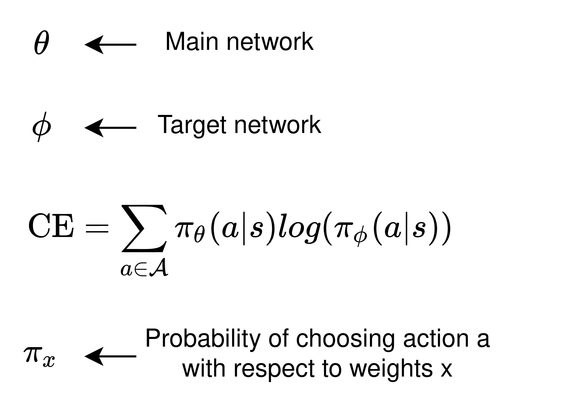
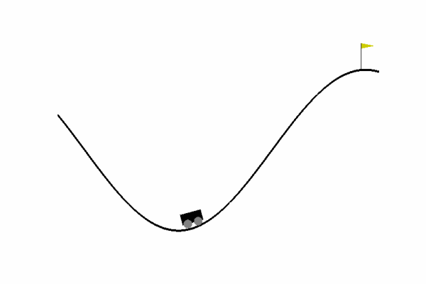
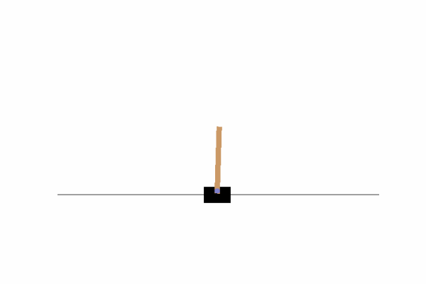

## Soft Deep Q-Learning with cross entropy regulation. 
This repository contains multiple deep Q-learning algorithm with an emphasis on faster and better convergence. A newton raphson approximation is explored in the update rule and compared against a vanilla deep Q-network (DQN) and against a novel algorithm named Soft-Q CE, which augment a novel cross entropy loss function.

## Description
In the search for faster and better convergence of Deep Q-Learning methods we augment the original temporal difference (TD) loss with a novel loss function, i.e., with cross entropy (CE) loss. We use Double Q-Learning method consisting of a main and a target network. The CE loss is calculated between the main and the target network.

<p align="center">

</p>

The augment CE loss is compared against a benchmark DQN. Additionally, we have explored a newton raphson method approximation for updating the weight of the DQN extened from TDProp algorithm (check reference).  
In the repository we present three results: 
- Study of depth and width of neural network used in DQN.
- Performance evaluation using TDProp Q.
- Performance evalutaion using soft-Q CE and comparison against other methods.

## Installation

### Prerequisites

Requires python 3 (>=3.5). You'll also need basic python packages pip, numpy and pickle.
PyTorch (CUDA optional) is required for TDProp Q and Soft-Q CE algorithm. The repository is currently tested with PyTorch
v1.8.1 with designed compatibility to older versions.

Alternate vanilla DQN uses tensorflow and keras v.

### Installing

- Clone the repo and cd into it:
    ```bash
       git clone https://github.com/ECE884Group1/ECE884_Final_Project.git
       cd ECE884_Final_Project
    ```
- If you don't have Pytorch installed already, install your favourite flavor of Pytorch. Please visit the following for [installation](https://pytorch.org/get-started).
- If you don't have gym installed already. In most cases, you may use
  ```bash
    pip install gym
    ```
    
- If you don't have TensorFlow installed already, install your favourite flavor of TensorFlow. In most cases, you may use
    ```bash 
    pip install tensorflow-gpu==1.14 # if you have a CUDA-compatible gpu and proper drivers
    ```
    or 
    ```bash
    pip install tensorflow==1.14
    ```
    to install Tensorflow 1.14, which is the latest version of Tensorflow supported by the master branch. Refer to [TensorFlow installation guide](https://www.tensorflow.org/install/)
    for more details. 
    
    In the codes for the baseline methods for both the Cartpole and the Mountain car environments, Keras has been used to implement Tensorflow. Keras is an open-source software library that provides a Python interface for the TensorFlow library. To intsall Keras, the following can be used:
    ```bash 
   pip install keras
    ```

## Usage 
You can run 'Cartpole_Baseline.py' and 'Mountain_Car_baseline.py' as a baseline for the proposed loss. Their primary purpose is to implement and evaluate the affect of depth and width in a Deep Q-Network for both the environments viz. CartPole and MountainCar. The code snippet mentioned below exemplifies two of the structures for DQN:

```Python
import keras  ## Import the Keras
from keras.models import Sequential  ## Sequential model from Keras
from keras.layers import Dense  ## Dense Layer from Keras
from keras.optimizers import Adam  ## Adam Optimizer from Keras
from keras.models import load_model  ## For saving and loading the Keras model
.
.
.

## DQN WITH 4 HIDDEN LAYERS FOR CARTPOLE
def get_model():  ## Build the Deep Q-Network
    model = Sequential()  ## Type of Model
    ####
    ## Input layer of Dimension 4 and 4 Hidden Layer of 24/48/48/48 nodes. Activation 'relu'
    ####
    model.add(Dense(24, input_shape=(OBSERVATIONS_DIM, ), activation='relu'))
    model.add(Dense(48, activation='relu'))  ## Add second Hidden Layer of 24 nodes. Activation 'relu'
    model.add(Dense(48, activation='relu')) 
    model.add(Dense(48, activation='relu')) 
    model.add(Dense(2, activation='linear'))  ## Add output layer of dimension 2. Activation 'linear'

    model.compile(  ## Compile the Model
        optimizer=Adam(lr=LEARNING_RATE),  ## Adam Optimizer with Initial Learning Rate=0.001 
        loss='mse',  ## MSE Loss
        metrics=[],
    )

    return model
```

```Python
from tensorflow.keras import models
from tensorflow.keras import layers
from tensorflow.keras.optimizers import Adam
.
.
.

## DQN WITH 2 HIDDEN LAYERS FOR MOUNTAIN CAR
def createNetwork(self):
        model = models.Sequential()
        state_shape = self.env.observation_space.shape

        model.add(layers.Dense(24, activation='relu', input_shape=state_shape))
        model.add(layers.Dense(48, activation='relu'))
        model.add(layers.Dense(self.env.action_space.n,activation='linear'))
        # model.compile(optimizer=optimizers.RMSprop(lr=self.learingRate), loss=losses.mean_squared_error)
        model.compile(loss='mse', optimizer=Adam(lr=self.learingRate))
        return model
```

You can use 'DQN_softQ_CE.py' or 'DQN_TD.py' as a template for training using either the CE loss or TDProp-Q respectively. You can import the algorithm through the RL_algo.py. The main arguments include **environment (gym), batch size, discount factor, learning rate, neural network size (tuple)**. Check below for the code snippet with the main components.

```Python
import gym
import import RL_algo as RL


# Import gym environment. 
env_name = 'CartPole-v1'

# Batch size.
batch_size = 32
# Discount factor.
gamma = 0.99
# Neural networ size.
NN_hidden_size = (96,96,48)
# DQN_CE agent.
agent_CE = RL.DQN_CE(env, batch_size = batch_size, gamma=gamma,\
               lr= 1e-3,hidden_sizes = NN_hidden_size)


########### Loop (for every episode) #############
########### Loop (for every time step) ###########
.
.
.
# Update the parameters with the sampled batch. 
batch = agent_CE.replay_buffer.sample_batch(batch_size)
.
.
.
.

```


You can use 'vanilla_Q.py' for implementation of default DQN algorithm using Pytorch.


## Results
We evaluate the developed algorithms in the CartPole v1 and MountainCar v0.

Cart Pole                  |  Mountain Car
:-------------------------:|:-------------------------:
|

[comment]: <p float="center">
[comment]:   
[comment]:   
[comment]: </p>

The convergence plot for the TDProp Q and Soft-Q CE for the MountainCar environment are shown below.
Cross Entropy (CE) vs 4 Hidden layer |  TDProp Q (TD) vs 4 Hidden layer (D 4HL)
:-----------------------------------:|:---------------------------------------:
.png)|.png)

[comment]: <p float="center">
[comment]:  
[comment]:  
[comment]: </p>

The convergence plot for the TDProp Q and Soft-Q CE for the CartPole environment are shown below 

Cross Entropy (CE) vs 4 Hidden layer |  TDProp Q (TD) vs 4 Hidden layer (D 4HL)
:-----------------------------------:|:---------------------------------------:
.png)|.png)


[comment]:<p float="center">
[comment]:  
[comment]:  
[comment]:</p>

|      Algorithm     | Average rewards Cart Pole | Average rewards Mountain Car |
|:------------------:|:-------------------------:|:----------------------------:|
| 2 Hidden layer DQN |           206.4           |            -118.21           |
| 4 Hidden layer DQN |            500            |            -101.07           |
| 7 Hidden layer DQN |           106.45          |            -107.07           |
|     Deep 96 DQN    |            500            |            -101.60           |
|    Deep 128 DQN    |            500            |            -126.47           |
|    Deep 256 DQN    |            500            |            -107.66           |
|     TDProp DQN     |            500            |            -121.02           |
|      Soft-Q CE     |            500            |            -100.01           |

## Citation

```
@article{Soft_Q_CE,
      title={Soft Q-Learning with cross entropy regulation}, 
      author={Sandeep Banik, Hrishikesh Dutta, Amit Kumar Bhuyan and Avirup Roy},
      year={2021},
      journal = {GitHub repository},
  	  howpublished = {\url{https://github.com/ECE884Group1/ECE884_Final_Project}
}
```


## Troubleshootings / Discussion

If you have any problem using repository or want to be a part of the project, contact any of the authors. [Sandeep Banik](baniksan@msu.edu), [Hrishikesh Dutta](duttahr1@msu.edu), [Amit Kumar Bhuyan](bhuyanam@msu.edu) and [Avirup Roy](royaviru@msu.edu) 
